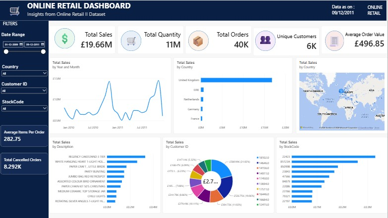

# 🛒 Online Retail Sales Dashboard

An end-to-end data analytics project that transforms a raw, messy e-commerce transactions dataset (1M+ rows) into a fully interactive Power BI dashboard — covering data cleaning, database storage, and dashboard design.



---

## 📌 Project Overview

This project analyzes the **Online Retail II** dataset — real transactional data from a UK-based online retailer spanning December 2009 to December 2011. The goal was to build a complete analytics pipeline, from raw CSV to a polished, decision-ready dashboard, using an industry-standard workflow.

> **Note:** The raw and cleaned CSV files are not included in this repository due to their size (90MB+). The dataset can be downloaded from the [UCI Machine Learning Repository](https://archive.ics.uci.edu/dataset/502/online+retail+ii). The full cleaning process is reproducible via `data_cleaning.ipynb`.

**Objective:** Practice and demonstrate a realistic data analyst workflow — data cleaning, relational database storage, and business intelligence dashboard creation.

---

## 🧰 Tools & Technologies

| Stage | Tool |
|---|---|
| Data Cleaning | Python (Pandas) |
| Database | PostgreSQL |
| DB-to-Python Connection | SQLAlchemy, psycopg2 |
| Dashboard | Power BI Desktop |
| Environment | VS Code + Jupyter Notebook |

---

## 🔄 Project Workflow

```
Raw CSV (1,067,371 rows)
        │
        ▼
  Data Cleaning (Pandas)
        │
        ▼
  Cleaned Dataset (1,003,687 rows)
        │
        ▼
  PostgreSQL Database
        │
        ▼
  Power BI Dashboard
```

### 1. Data Cleaning (Pandas)

The raw dataset had several real-world data quality issues, each identified and resolved step-by-step:

| Issue | Action Taken | Rows Affected |
|---|---|---|
| Duplicate rows | Removed with `drop_duplicates()` | 34,335 |
| Missing product descriptions (all Price = 0) | Dropped as non-sales/junk entries | 4,275 |
| Cancelled orders (Invoice starting with 'C') | Separated into `cancelled_orders.csv` for return-rate analysis | 19,104 |
| Zero / negative price rows | Removed (free samples, manual adjustments, damages) | 1,744 |
| Missing Customer ID | Filled with `"Guest"` to preserve revenue accuracy while flagging non-identified buyers | 228,488 |
| Non-product stock codes (POSTAGE, MANUAL, DISCOUNT, BANK CHARGES, etc.) | Removed — not real product sales | 4,226 |
| InvoiceDate stored as text | Converted to proper datetime type | — |

**Final cleaned dataset: 1,003,687 rows**

Cancelled orders were preserved separately rather than discarded, so return-rate analysis remains possible in future iterations.

### 2. Database Storage (PostgreSQL)

The cleaned dataset was loaded into a PostgreSQL database using Python (`SQLAlchemy` + `psycopg2`), rather than working directly off a CSV — reflecting how analytics pipelines are typically structured in production environments.

### 3. Dashboard (Power BI)

Power BI connects directly to the PostgreSQL database and includes:

**KPI Cards**
- Total Sales
- Total Quantity
- Total Orders
- Unique Customers
- Average Order Value

**Visuals**
- Sales Over Time (monthly trend line)
- Sales by Country (top 5, bar chart)
- Sales by Country (map)
- Top 10 Products by Sales
- Sales by Customer (donut, top 10, guest checkouts excluded)
- Sales by Stock Code Category (top 10)

**Interactive Filters**
- Date Range
- Country
- Customer ID
- Stock Code

---

## 📊 Key Insights

- The United Kingdom is the dominant market by a wide margin.
- Sales show a strong seasonal spike in November–December, consistent with holiday shopping behavior.
- A small number of products account for a disproportionate share of total revenue.

---

## 📁 Repository Structure

```
├── online_retail_II.csv              # Raw source data
├── Cleaned Online Retail Data.csv    # Cleaned dataset used for the dashboard
├── cancelled_orders.csv              # Cancelled/returned orders (separated during cleaning)
├── non_cancelled_orders.csv          # Intermediate file from the cleaning process
├── data_cleaning.ipynb               # Step-by-step Pandas cleaning notebook
├── Online_retail_Dashboard.pbix      # Power BI dashboard file
├── Online_retail_Dashboard.pdf       # PDF export of the dashboard
└── README.md
```

---

## 🚀 How to Reproduce

1. Clone this repository
2. Run `data_cleaning.ipynb` to reproduce the cleaning steps (requires `pandas`, `sqlalchemy`, `psycopg2-binary`)
3. Load the cleaned data into a PostgreSQL database of your choice
4. Open `Online_retail_Dashboard.pbix` in Power BI Desktop and update the database connection details

---

## 👤 Author

**Aniket Sahu**
[LinkedIn](https://linkedin.com/in/aniket-sahu-1b8b38362) • [GitHub](https://github.com/AniketS-456)
